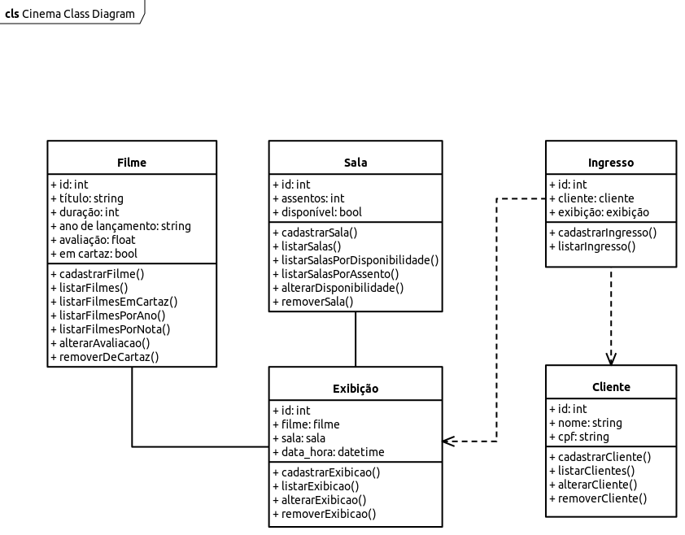

# API para gerenciamento de um cinema.

## Resumo
Este projeto tem como finalidade o desenvolvimento de uma WebAPI simples para gerencimento de um cinema. A aplicação é escrita em C#, utilizando-se do Entity Framework e SQLite.
Esta API consiste em cinco entidades, sendo elas: sala, filme, exibição, cliente e ingresso e que atendem às operações básicas para dados: C(reate), R(ead), U(pdate), D(elete).
Os principais objetivos é fazer com que seja possível gerar uma exibição com data e hora após cadastrado um filme e uma sala e também gerar um ingresso a partir dessa exibição e de um cliente.

## Funcionalidades
### Gerenciamento de sala
A classe modelo consistirá nas propriedades de `id`, `assento` e `disponível`. O sistema permitirá três formas de listagem de salas: todas, por disponibilidade e por assento. Também contará com a alteração da disponibilidade.

### Gerenciamento de filme
A classe modelo consistirá nas propriedades de `id`, `título`, `duração`, `ano_lançamento`, `avaliação` e `em cartaz`. O sistema permitirá que após um filme cadastrado, seja possível alterar a nota de avaliação, assim como a remoção do cartaz (propriedade `em cartaz` alterado para falso).

### Gerenciamento de cliente
A classe modelo consistirá nas propriedades de `id`, `nome` e `cpf`. Haverá as operações de cadastramento, listagem, alteração e exclusão.

### Gerenciamento de exibição
A classe modelo consistirá nas propriedades de `id`, `filme`, `sala` e `data_hora`. Será possível cadastrar, listar, alterar e remover uma exibição.

### Gerencimento de ingresso
A classe modelo consistirá nas propridades de `id`, `cliente` e `exibição`. Será permitido o cadastramento e a listagem de ingressos.

